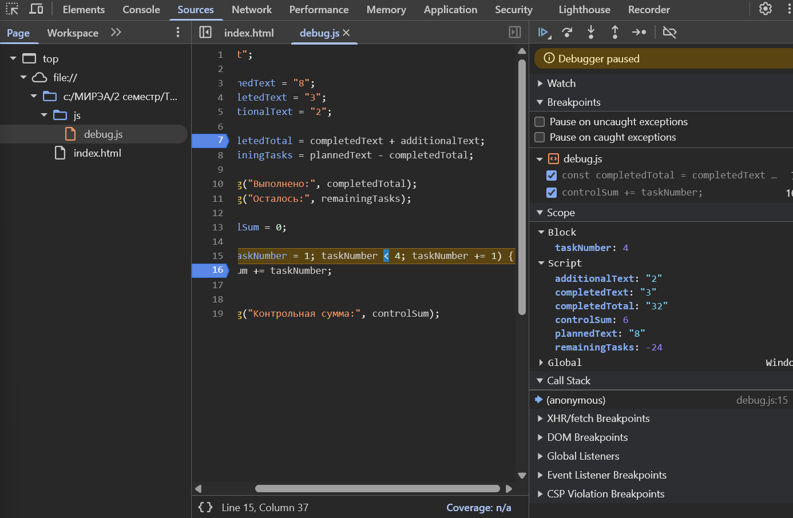

## Автор

Имя: Шишов Даниил Андреевич
Группа: ЭФБО-06-25

## Окружение
- Windows 11
- Node.js v24.21.0
- npm v11.19.0
- Git v2.53.0.windows.1
- VSCode integrated browser

## Задание №1
- Файл запущен при помощи команды node. Вывод появился в терминале. Тип документа: undefined
- Файл запущен в браузере. Вывод появился в Console. Тип документа: object
-Это происходит, потому что в Node каждый запущенный файл считается изолированным модулем

## Задание №2

### Таблица исследования

| **Выражение**      | **Ожидание до запуска** | **Фактическое значение** | **Тип результата** | **Объяснение** |
| ------------------ | ----------------------- | ------------------------ | ------------------ | -------------- |
| `"8" + 2`          | `"82"`                   | `"82"`                   | `string`           | Оператор `+` при наличии строки выполняет конкатенацию, поэтому число `2` преобразуется в строку. |
| `"8" - 2`          | `6`                      | `6`                      | `number`           | Оператор `-` не работает со строками и преобразует `"8"` в число. |
| `Number("8") + 2`  | `10`                     | `10`                     | `number`           | `Number("8")` явно преобразует строку `"8"` в число `8`. |
| `"12" > "3"`       | `false`                  | `false`                  | `boolean`          | Обе величины являются строками, поэтому сравнение выполняется лексикографически: `"1"` меньше `"3"`. |
| `12 === "12"`      | `false`                  | `false`                  | `boolean`          | Строгое сравнение `===` не выполняет преобразование типов: `number` не равен `string`. |
| `Number("")`        | `0`                      | `0`                      | `number`           | Пустая строка при преобразовании в число превращается в `0`. |
| `Number("text")`    | `NaN`                    | `NaN`                    | `number`           | Строку `"text"` невозможно преобразовать в число, поэтому получается `NaN`. |
| `Boolean("false")`  | `true`                   | `true`                   | `boolean`          | Любая непустая строка является истинным значением (`true`), независимо от её содержимого. |
| `typeof null`       | `"object"`               | `"object"`               | `string`           | `typeof null` исторически возвращает `"object"`. Это особенность JavaScript. |
| `typeof NaN`         | `"number"`               | `"number"`               | `string`           | `NaN` означает «не число», но технически имеет тип `number` в JavaScript. |

## Задание №3
### Данные для варианта
- `totalTasks` = `10 ` , `CompletedTasks` = `7`

### Результат проверки данных
- Всего задач: 10
- Выполнено: 7
- Осталось: 3
- Прогресс: 70.0%
- Статус: В работе

## Задание №4
### Данные для варианта
- `totalTasks` = `10 ` , `CompletedTasks` = `7`, `dailyLimit` = `3`

### Результат проверки данных
- Осталось задач: 3
- День 1: выполнено 3, осталось 0
- Потребуется дней: 1

## Задание №5

### Фактический вывод исходной программы

- Выполнено: 32
- Осталось: -24
- Контрольная сумма: 6

### Таблица ошибок

| **Ошибка**                 | **Что наблюдалось** | **Причина** | **Исправление** | **Результат после исправления** |
| -------------------------- | ------------------- | ----------- | --------------- | ------------------------------- |
| Обработка количества задач | `completedTotal` имел значение `"32"` и тип `string` | `completedText` и `additionalText` являются строками, поэтому оператор `+` выполнил конкатенацию вместо сложения чисел | Преобразовать строки в числа с помощью `Number()` | `Выполнено: 5`, `Осталось: 3` |
| Граница цикла              | При `taskNumber = 4` условие `4 < 4` стало ложным, поэтому тело цикла не выполнилось; контрольная сумма осталась `6` | Использована граница `< 4`, которая не включает число `4` | Заменить `< 4` на `<= 4` | `Контрольная сумма: 10` |

### Иллюстрация отладки

### Результат после исправления

- Выполнено: 5
- Осталось: 3
- Контрольная сумма: 10

### Вывод
Наиболее показательной была ошибка с `"3" + "2"`, поскольку после `Step over` появляется `completedTotal = "32"` (`string` -> `string`)
